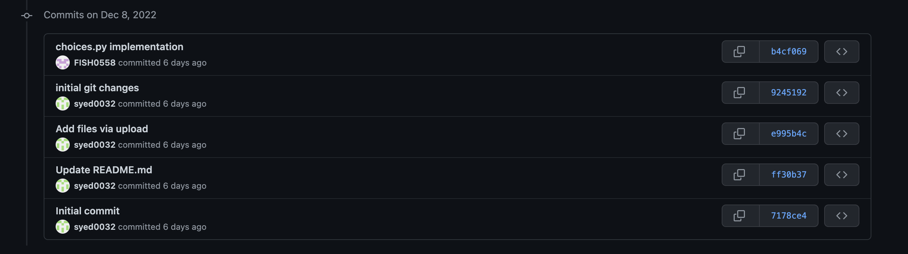
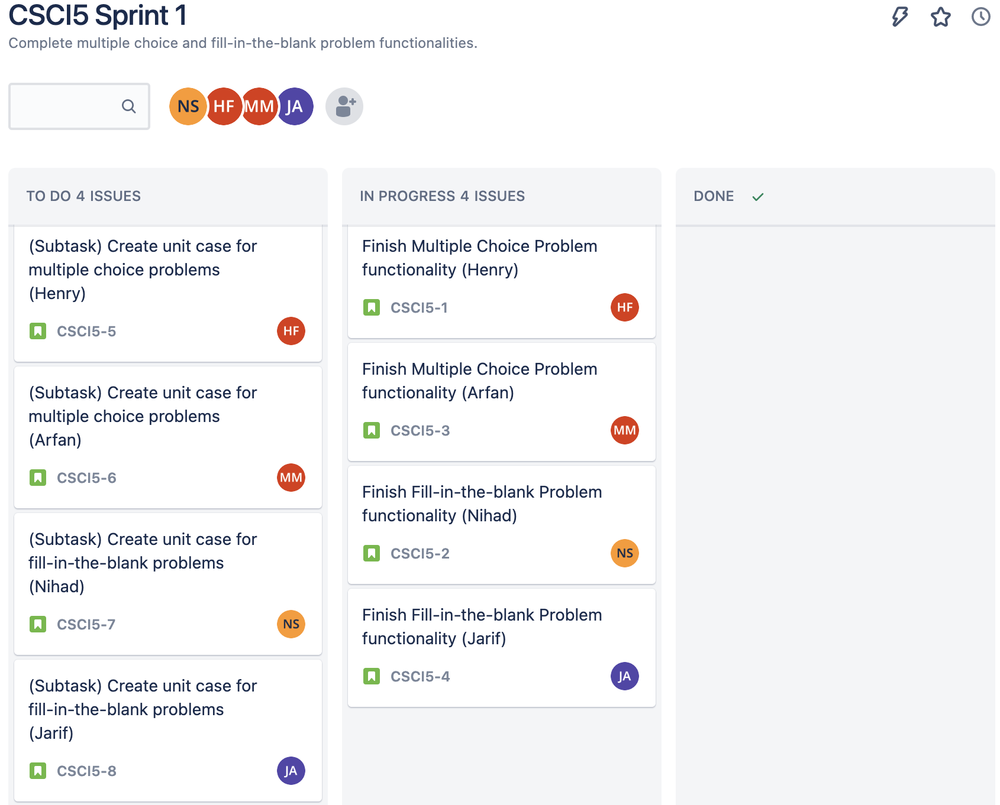

### (SCRUM Screenshots and Version Control times under "SCRUM_Screenshots" folder)

### Sprint Planning Meeting (1-2hrs) 12/8
Time elapsed: 1 hr  

Content:  
In the first sprint planning meeting, we created a backlog that contains two user stores: one concerning the generation of multiple-choice problems, the other concerning the generation of fill-in-the-blank problems. We assigned developers to each of these stories: Nihad and Jarif to the fill-in-the-blank story, Henry and Arfan to the multiple-choice story. We have four stories for multiple choice which whom two of them concerning the development of the function and two of them concerning the unit testing of them. And this is the same for fill-in-the-blank. Each of these stories were assigned sub-tasks, which were added to the story board. We also assigned the estimated time to completion to each user story and their respective sub-tasks. Lastly, we created a sprint schedule where we scheduled our retrospective, review, and scrum meetings for the sprint.

### 3 Daily Sprint Meetings (10-15 min)

#### **12/10**
Time elapsed: 15 min  

Contents:  
We talked about our inital challenges and progess with making our functions for multiple choice and fill in the blank problems. This largely dealt with developing a basic understanding of the problem and what is required for the final executable. We discussed strategies for overcoming these hurdles and then planned what progress needs to be done by the next sprint. 

 
 

(1) What did you do? 
-Nihad: worked on fill-in-the-blank task
-Jarif: worked on fill-in-the-blank task
-Arfan: worked on multiple-choice task
-Henry: worked on multiple-choice task

(2) What will you do? 
-Nihad: continue working on fill-in-the-blank task
-Jarif: continue working on fill-in-the-blank task
-Arfan: continue working on multiple-choice task
-Henry: continue working on multiple-choice task

(3) What's not working?
-We all discussed and agreed collectivly that we had different ideas for the implementation of these tasks. Above we have more information regarding this. 

#### **12/11**
Time elapsed: 15 min  

Contents:
We talked about our shortcomings with our individual fuctionalites and what we need to be have them finished. Particularly, we had difficulty with dealing with lines in the source code file solely containing a newline character. We then dicussed merging the functions together in the same file but have not done so. We also talked about unit test cases for a little bit and how we would implement it. 

(1) What did you do? 
-Nihad: worked on fill-in-the-blank task and looked into unit testing
-Jarif: worked on fill-in-the-blank task
-Arfan: worked on multiple-choice task and looked into unit testing
-Henry: worked on multiple-choice task

(2) What will you do? 
-Nihad: continue working on fill-in-the-blank task and start working on unit testing
-Jarif: continue working on fill-in-the-blank task and start working on unit testing
-Arfan: continue working on multiple-choice task and start working on unit testing
-Henry: continue working on multiple-choice task and start working on unit testing

(3) What's not working?
-We all had problenms with merging together our indivdual work into our own teams functions and had problems with the source file. Above has more information regarding this. 

#### **12/12**
Time elapsed: 30 min

Contents:
This was our last sprint meeting where we succesfully combined our two functionalites in one file. We also ran over our unit tests one last time before submission to ensure all tests were being passes. Lastly, we did one last code review session to make sure everything was prepared for submission. Once that was completed, we downloaded our project as a .zip file and submitted it to Canvas. 

(1) What did you do? 
-Nihad: finished fill-in-the-blank task and unit testing task
-Jarif: finished fill-in-the-blank task and unit testing task
-Arfan: finished working on multiple-choice task and unit testing task
-Henry: finished working on multiple-choice task and unit testing task

(2) What will you do? 
-Nihad: Compile our work and submit
-Jarif: Compile our work and submit
-Arfan: Compile our work and submit
-Henry: Compile our work and submit

(3) What's not working?
-Everything worked fine, just had confusion on all the what exactly to submit to canvas but that was resolved

### Sprint Retrospective (~1hr) 12/13
Time elapsed: 1hr

Content:
From the time we have spent working on this project, we were able to complete the multiple choice (choice.py) and fill-in-the-blank (blanks.py), able to produce output files based on input test files, as well as improve the code overall from what we used for the Parson's Problems code scrambler to make the code cleaner and reusable. Through the use of Jira, we were able to distribute the work evenly across team members, so everyone was able to put an equal shared effort to the project. At the end, we were able to achieve our goals in a timely and satisfactory manner.
Still, there were still some things that did not work well. For instance, keeping a consistent Sprint schedule proved difficult to do as we had conflicting schedules and priorities to create meetings around. There were also conflicts in some parts regarding how the implementation would be written. Next time, we will try to write more concrete design/specification so that there would be no confusions behind how the code would be structured.

### Sprint Review (~1hr) 12/14
Time elapsed: 1 hr

Content:
During the sprint review, our team assessed the work that we have completed and reflected on what can be changed to our deliverable in future sprints. First, we reached a consensus that the our implementation satisfied all project requirements. Second, we perused through the backlog and marked all completed tasks as complete. Third, we created stories in the backlog that are to be taken out and worked on in future sprints. These stories largely concern bug fixes and feature updates. These include, but are not limited to, removing newline code lines from the array storing non-omitted lines of code, error-checking for minimum number of required non-omitted lines of code, increasing the maximum number of words to blank out in fill-in-the-blank problems, feature update allowing the use of a GUI, and a feature update allowing for user interaction with the generated problem file within the application. 
